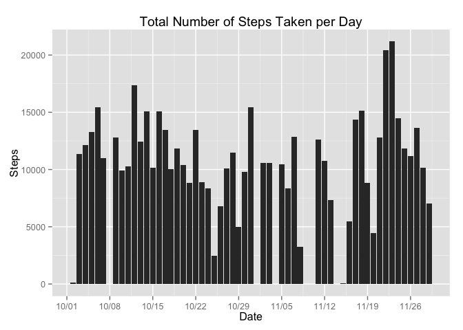
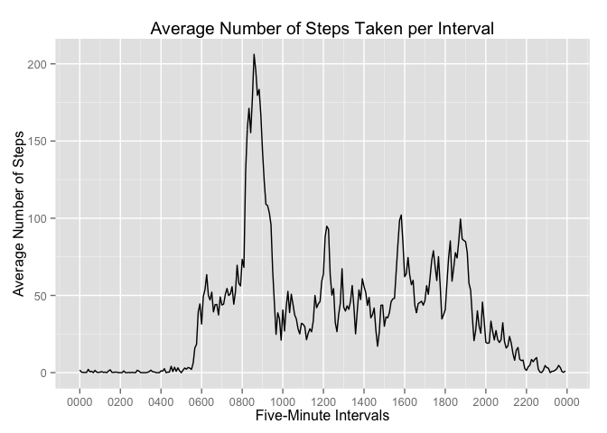
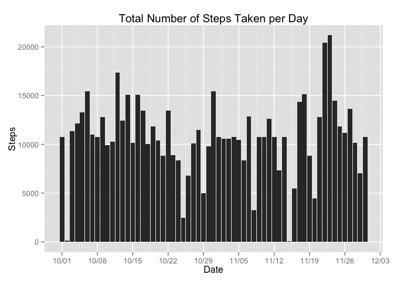
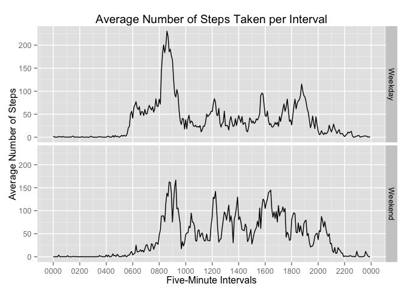

# Reproducible Research: Peer Assessment 1
## Introduction
This report is part of the Coursera course "Reproducible Research". The data 
that will be used for this assignment is collected via a personal activity monitoring
device. The dataset consists of the number of steps an individual has taken in during 
the months October and November, 2012. The number of steps have been recorded per 5
minute interval per day.
\
\
The dataset consists of three variables:  

1. **steps**: Number of steps taking in a 5-minute interval (missing values are coded as NA)
2. **date**: The date on which the measurement was taken in YYYY-MM-DD format
3. **interval**: Identifier for the 5-minute interval in which measurement was taken

The dataset is stored in a comma-separated-value (CSV) file, which consists of 
17,568 observations.

## 1. Loading and preprocessing the data
The dataset will be loaded into R and saved as a dataframe. The class of the date variable
(which R initally denotes as a factor variable) will be changed to the Date class.
In addition, three packages will be loaded that are used for data processing and
plotting.


```r
# Loading the activity.csv file into R and saving it as a dataframe
data <- read.csv("./activity.csv")

# Change the class of the variable "date" to the Date class.
data$date <- as.Date(data$date)

# Load the relevant packages
library(dplyr)
```

```
## 
## Attaching package: 'dplyr'
## 
## The following object is masked from 'package:stats':
## 
##     filter
## 
## The following objects are masked from 'package:base':
## 
##     intersect, setdiff, setequal, union
```

```r
library(ggplot2)
library(scales)
```

## 2. What is mean total number of steps taken per day?
In this part of the assignment, the total number of steps per day will be calculated.
A histogram of the total number of steps per day will be presented first.

```r
# Group the data by date
grdata <- group_by(data, date)

## 1. Calculate the total number of steps per day
totalsteps <- summarize(grdata, sum(steps))

## 2. Make a Histogram of the Total Number of Steps per Day
# Change Columnnames
colnames(totalsteps) <- c("Date", "Steps")

# Create the Histogram 
p1 <- ggplot(data = totalsteps, aes(x= Date, y= Steps))
p1 <- p1 + geom_histogram(stat="identity")

# Adapt the labels on the x-axis to improve readability of the plot
# Change the dateformat so that it displays the month and the day
# Create a label for every week
p1 <- p1 + scale_x_date(labels = date_format("%m/%d"), breaks = date_breaks("week"))

# Add the plot title
p1 <- p1 + ggtitle("Total Number of Steps Taken per Day")

# Print the plot
print(p1)
```

```
## Warning: Removed 8 rows containing missing values (position_stack).
```

 

In addition, the mean and median number of steps per day will be calculated.

```r
## 3. Calculate and Report the Mean and Median
# Calculate and report the mean total steps per day
round(mean(totalsteps$Steps, na.rm = TRUE), digits = 2)
```

```
## [1] 10766.19
```


```r
# Calculate and report the median total steps per day
median(totalsteps$Steps, na.rm = TRUE)
```

```
## [1] 10765
```

## 3. What is the average daily activity pattern?
In this section, the average number of steps per five-minute interval will be computed.
The original interval variable indicates ever interval with the fift mintute (e.g., 15, 20, 25)
and it denotes the change between hours with an increase of 100 (e.g. 50, 55, 100).
This means that a gap of 55 exists between each of the hours. Using this variable
directly as a scale in a plot will lead to incorrect results. It is for this reason
that this variable will be transformed from the integer class to the POSIX class.


```r
# Group the data by interval
grdataint <- group_by(data, interval)

# Calculate the Average Number of Steps per Interval
averagesteps <- summarize(grdataint, mean(steps, na.rm = TRUE))

# Compute the interval as time variable
# Create an empty dataframe
intervaltime <- data.frame()

# For every row in the average steps per interval dataset, check the interval
# number and add zeros where needed, so every interval consists of 4 digits
# E.g. 5 becomes 0005, 125 becomes 0125.
for(n in 1:nrow(averagesteps)) {
        # Create a temporary dataframe to store the results
        intervaltemp <- data.frame(matrix(data = NA, ncol = 1, nrow = 1))
        colnames(intervaltemp) <- "intervaltime"
        
        # If the interval has two digits, add three zeros
        if(nchar(averagesteps[n,1]) == 1) {
                intervaltemp[1] <-  paste0("000", averagesteps[n,1]) 
        } else {
                # If the interval has two digits, add two zeros
                if(nchar(averagesteps[n,1]) == 2) {
                        intervaltemp[1] <- paste0("00", averagesteps[n,1]) 
                } else {
                        # If the interval has three digits, add one zero
                        if(nchar(averagesteps[n,1]) == 3) {
                                intervaltemp[1] <- paste0("0", averagesteps[n,1]) 
                        } else {
                                intervaltemp[1] <- averagesteps[n,1]
                        }
                }
        }
        # Store the new number in the intervaltime dataframe
        intervaltime <- rbind(intervaltime, intervaltemp)
}
# Add a variable to the averagesteps dataset that consists of the intervals
# in the POSIX class. Note that the day is the day when the script has been
# executed, but that does not matter for the plot, because the date will be 
# suppressed. We are not interested in the date, but in the time intervals 
# accross a number of days.
averagesteps$Time <- strptime(intervaltime[,1], "%H%M")
```

After the average number of steps per interval have been calculated and the intervals
have the correct time-based format, a Time Series plot will be created.


```r
## 1. Make a Time Series Plot of the Intervals (x-axis) and average steps (y-axis)
# Change columnnames
colnames(averagesteps) <- c("Interval", "Steps", "Time")

# Create the plot
p2 <- ggplot(averagesteps, aes(x = Time, y = Steps))

# Create a time series plot
p2 <- p2 + geom_line()

# Add the plot title
p2 <- p2 + ggtitle("Average Number of Steps Taken per Interval")

# Change the Y-axis Label
p2 <- p2 + ylab("Average Number of Steps")

# Change the X-axis Label
p2 <- p2 + xlab("Five-Minute Intervals")

# Change the X-axis ticks so they indicate every 2 hours.
p2 <- p2 + scale_x_datetime(labels = date_format("%H%M"), breaks = date_breaks("2 hour"))

# Print the plot
print(p2)
```

 

The interval that conists of the maximum number of steps will be computed next.


```r
## 2. Which 5-minute Interval, On Average, Contains the Maximum Number of Steps?

# Drop the Time variable so that the dataframe properly works with dplyr
averagesteps <- averagesteps[,1:2]

# Store the maximum number of steps and it's corresponding interval
a <- filter(averagesteps, Steps == max(Steps))

# Store the interval
maxint <- a[[1]]
# Store the maximum number of steps
maxsteps <- round(a[[2]], digits = 0)
```

The maximum number of steps are 206 and the corresponding interval is 835. 
This means that the maximum number of steps, on average, have been taken in the 
five minute interval between 08:30 and 08:35.

## 4. Imputing missing values
There are a number of days which contain missing values. First, every variable
will be examined for missing values (NAs).


```r
# Check whether each of the variables contain any missing values and calculate
# the number
sum(is.na(data$steps) == TRUE)
```

```
## [1] 2304
```

```r
sum(is.na(data$date) == TRUE)
```

```
## [1] 0
```

```r
sum(is.na(data$interval) == TRUE)
```

```
## [1] 0
```

This analysis shows that only the steps variable contains missing values. The
number of NAs is 2304. To fill in these missing values, the average number of 
steps for the corresponding interval (as computed above) will be used.


```r
## 2. Devise a strategy for filling in all of the missing values in the dataset
# Create a new dataset from the old one that can be used to fill in the 
# missing values
datanew <- data

# The only variable with NAs is the steps variable. To impute the missing value
# the average number of steps for the corresponding interval will be used.
for(n in 1:nrow(datanew)) {
        # Create a subset containing only the row
        s <- datanew[n,]
        
        # Check whether the steps variable is NA
        if(is.na(datanew[n,1]) == TRUE) {
                # Store the interval number
                i <- datanew[n,3]
                # Subset the averagesteps dataset to find the corresponding
                # average number of steps
                as <- filter(averagesteps, Interval == i)
                # Substitute the NA value with the average number of steps
                # for that interval
                datanew[n,1] <- as[,2]
        }
}
```

A histogram of the new (and complete) dataset will be created next.


```r
# Group the data by date
grdatanew <- group_by(datanew, date)

## 1. Calculate the total number of steps per day
totalstepsnew <- summarize(grdatanew, sum(steps))

## 2. Make a Histogram of the Total Number of Steps per Day
# Change Columnnames
colnames(totalstepsnew) <- c("Date", "Steps")

# Create the Histogram 
p3 <- ggplot(data = totalstepsnew, aes(x= Date, y= Steps))
p3 <- p3 + geom_histogram(stat="identity")

# Adapt the labels on the x-axis to improve readability of the plot
# Change the dateformat so that it displays the month and the day
# Create a label for every week
p3 <- p3 + scale_x_date(labels = date_format("%m/%d"), breaks = date_breaks("week"))

# Add the plot title
p3 <- p3 + ggtitle("Total Number of Steps Taken per Day")

# Print the plot
print(p3)
```

 

In addition, the mean and median number of steps per day will be calculated.

```r
# Calculate the mean total steps per day
round(mean(totalstepsnew$Steps), digits = 2)
```

```
## [1] 10766.19
```


```r
# Calculate the median total steps per day
median(totalstepsnew$Steps)
```

```
## [1] 10766.19
```

The mean number of steps per day in the dataset with missing values is 10766.18 
and the median is 10765. The mean in the imputed dataset is 10766.19 as well,
and the meidan is 10766.19. It can therefore be concluded that the mean has
stayed the same, but that the median has changed.

## 4. Are there differences in activity patterns between weekdays and weekends?
To examine whether there are differences in activity patterns between weekdays 
and weekends, the dates first have to be classified as beloning to one of the two.


```r
# Because the system language of my Mac is Dutch, I changed it to English
# so I the weekdays aren't returned in Dutch
Sys.setlocale(category = "LC_ALL", locale = "en_US")
```

```
## [1] "en_US/en_US/en_US/C/en_US/nl_NL.UTF-8"
```

```r
# Create a new variable called "Weekdays" displaying the day of the week and
# add it to the existing dataframe
datanew <- mutate(datanew, weekdays = weekdays(datanew$date))

#  Create a new empty variable called "Weekend"
datanew$weekend <- NA

# Fill the variable with either "Week" or "Weekend" based on the Weekday
for(i in 1:nrow(datanew)) {
        if(datanew[i,4] == "Saturday") {
                datanew[i,5] <- "Weekend"
        } else {
                if(datanew[i,4] == "Sunday") {
                          datanew[i,5] <- "Weekend"      
                } else {
                        datanew[i,5] <- "Weekday" 
                }
        }
}

# Delete the weekday column
datanew$weekdays <- NULL
```

Next, the average number of steps per interval, per weekend or weekday will be 
calculated.


```r
# Group the data by interval and Weekend
grdataweek <- group_by(datanew, interval, weekend)

# Calculate the Average Number of Steps per Interval
averagestepsweek <- summarize(grdataweek, mean(steps))

# Compute the interval as time variable
# Create an empty dataframe
intervaltime <- data.frame()

# For every row in the average steps per interval by Week/Weekend dataset, 
# check the interval number and add zeros where needed, so every interval 
# consists of 4 digits. E.g. 5 becomes 0005, 125 becomes 0125.
for(n in 1:nrow(averagestepsweek)) {
        # Create a temporary dataframe to store the results
        intervaltemp <- data.frame(matrix(data = NA, ncol = 1, nrow = 1))
        colnames(intervaltemp) <- "intervaltime"
        
        # If the interval has two digits, add three zeros
        if(nchar(averagestepsweek[n,1]) == 1) {
                intervaltemp[1] <-  paste0("000", averagestepsweek[n,1]) 
        } else {
                # If the interval has two digits, add two zeros
                if(nchar(averagestepsweek[n,1]) == 2) {
                        intervaltemp[1] <- paste0("00", averagestepsweek[n,1]) 
                } else {
                        # If the interval has three digits, add one zero
                        if(nchar(averagestepsweek[n,1]) == 3) {
                                intervaltemp[1] <- paste0("0", averagestepsweek[n,1]) 
                        } else {
                                intervaltemp[1] <- averagestepsweek[n,1]
                        }
                }
        }
        # Store the new number in the intervaltime dataframe
        intervaltime <- rbind(intervaltime, intervaltemp)
}
# Add a variable to the averagesteps dataset that consists of the intervals
# in the POSIX class. Note that the day is the day when the script has been
# executed, but that does not matter for the plot, because the date will be 
# suppressed. We are not interested in the date, but in the time intervals 
# accross a number of days.
averagestepsweek$Time <- strptime(intervaltime[,1], "%H%M")
```

Finally, a panel plot will be created, showing the average number of steps taken
per interval, per weekend and per weekday.


```r
## 1. Make a Time Series Plot of the Intervals (x-axis) and average steps (y-axis)
# Change columnnames
colnames(averagestepsweek) <- c("Interval", "Weekend", "Steps", "Time")

# Create the plot
p4 <- ggplot(averagestepsweek, aes(x = Time, y = Steps))

p4 <- p4 + facet_grid(Weekend ~ .)

# Create a time series plot
p4 <- p4 + geom_line()

# Add the plot title
p4 <- p4 + ggtitle("Average Number of Steps Taken per Interval")

# Change the Y-axis Label
p4 <- p4 + ylab("Average Number of Steps")

# Change the X-axis Label
p4 <- p4 + xlab("Five-Minute Intervals")

# Change the X-axis ticks so they indicate every 2 hours.
p4 <- p4 + scale_x_datetime(labels = date_format("%H%M"), breaks = date_breaks("2 hour"))

# Print the plot
print(p4)
```

 

